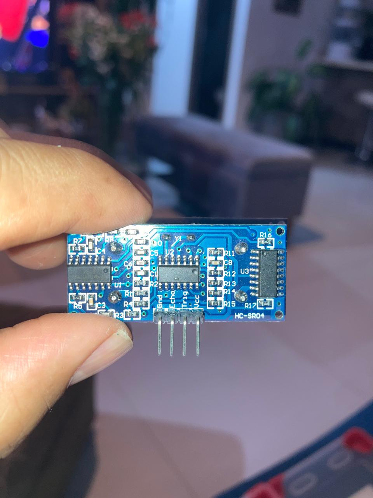
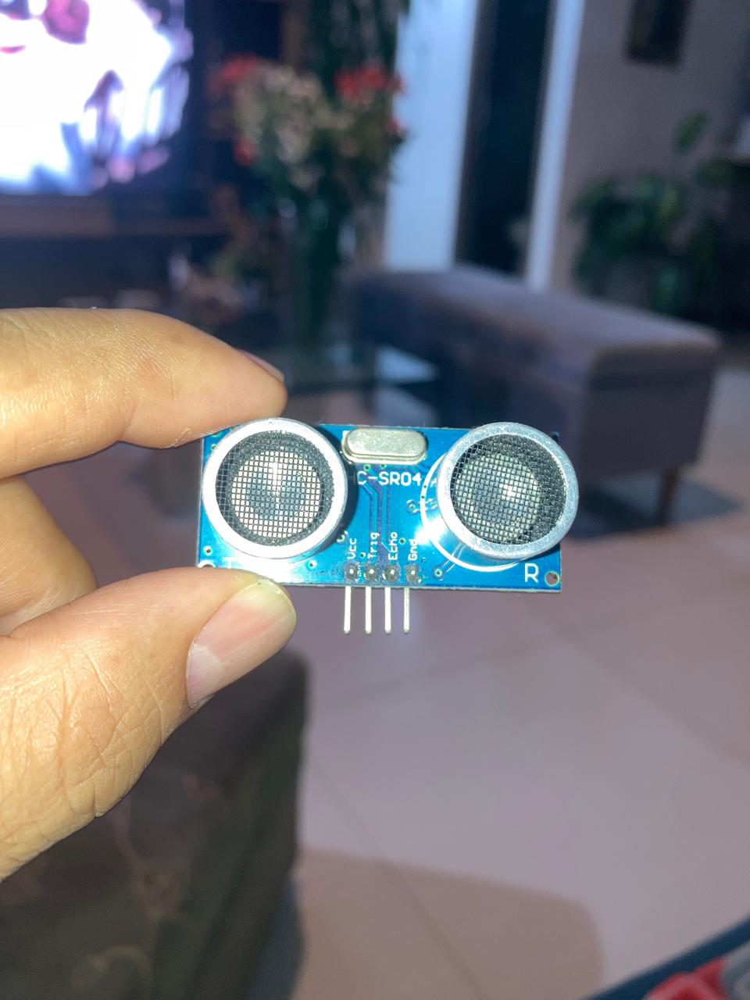
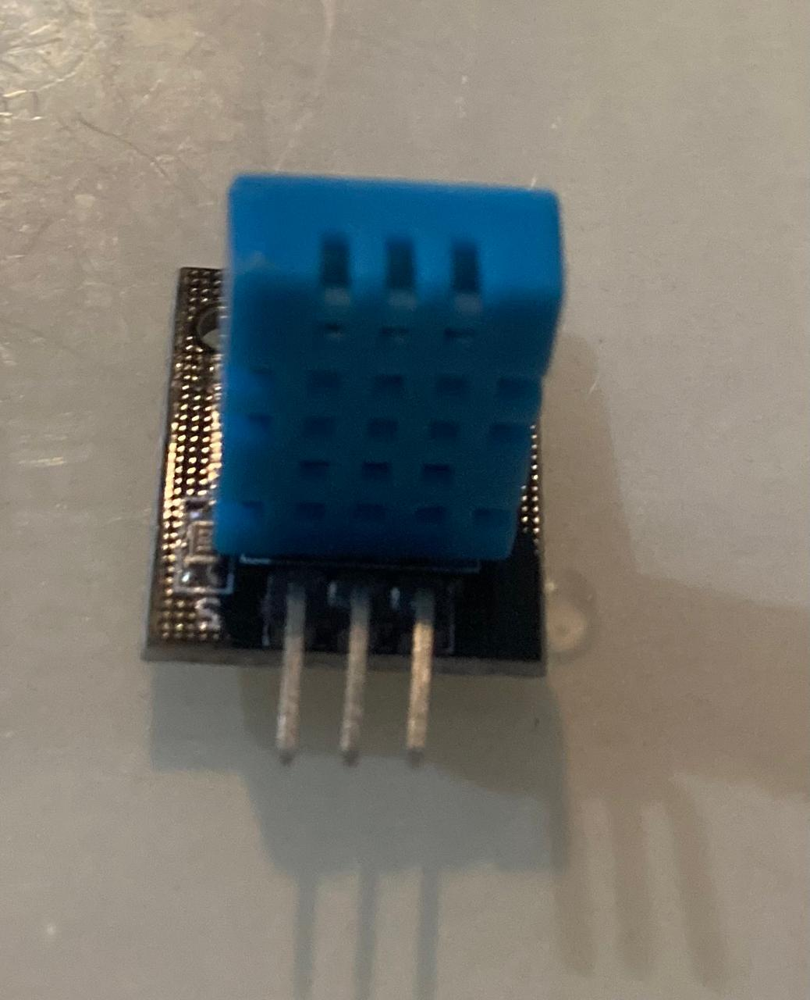
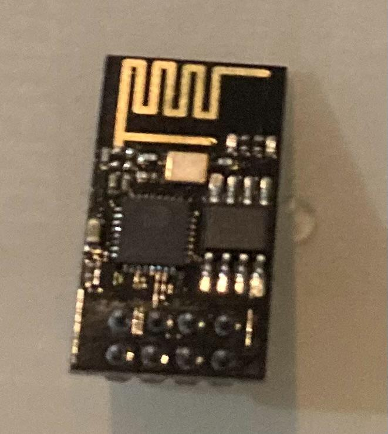
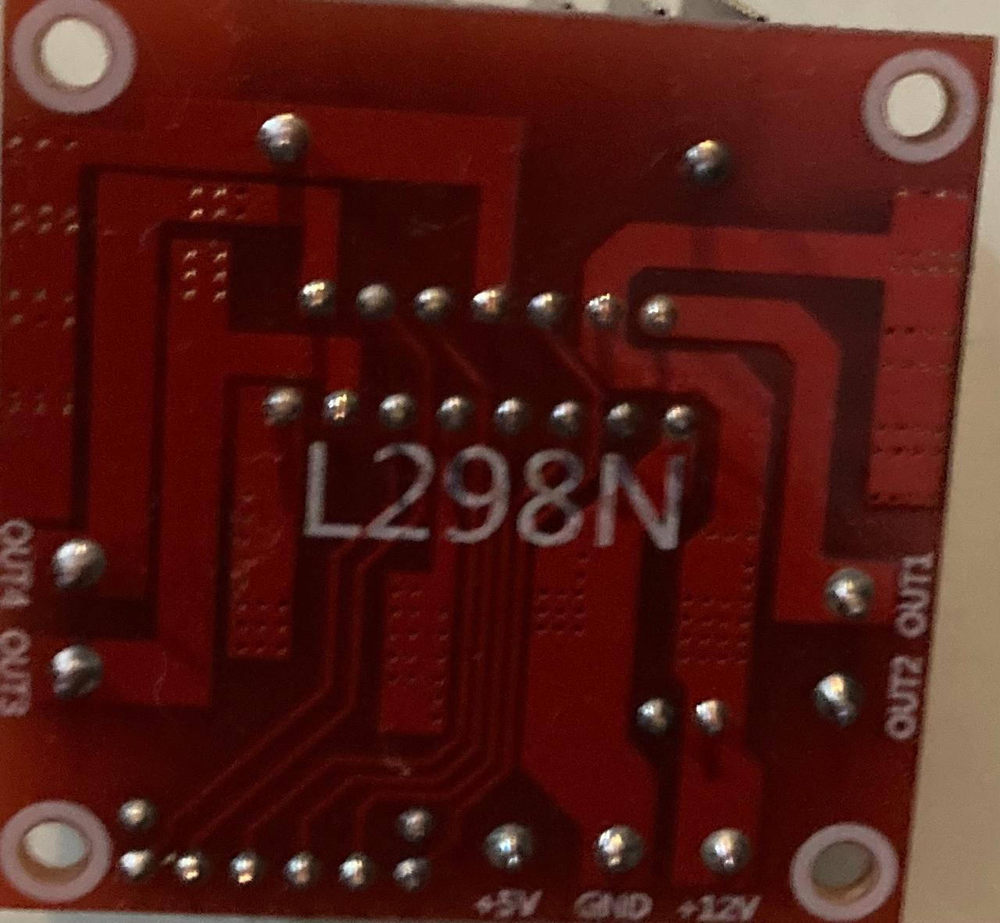
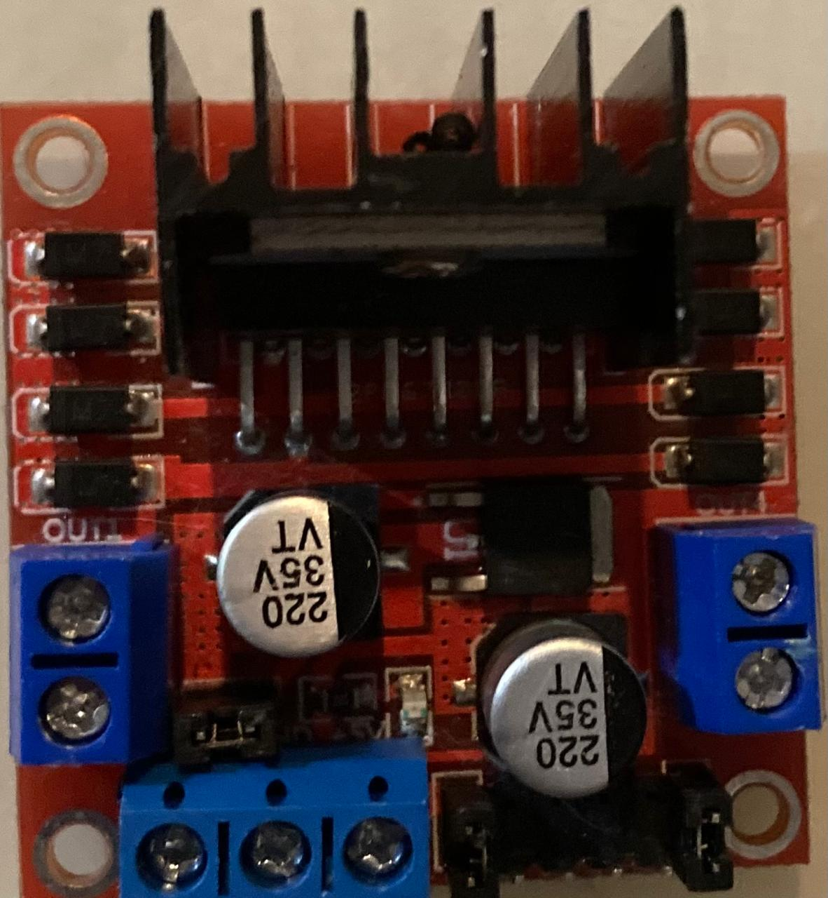
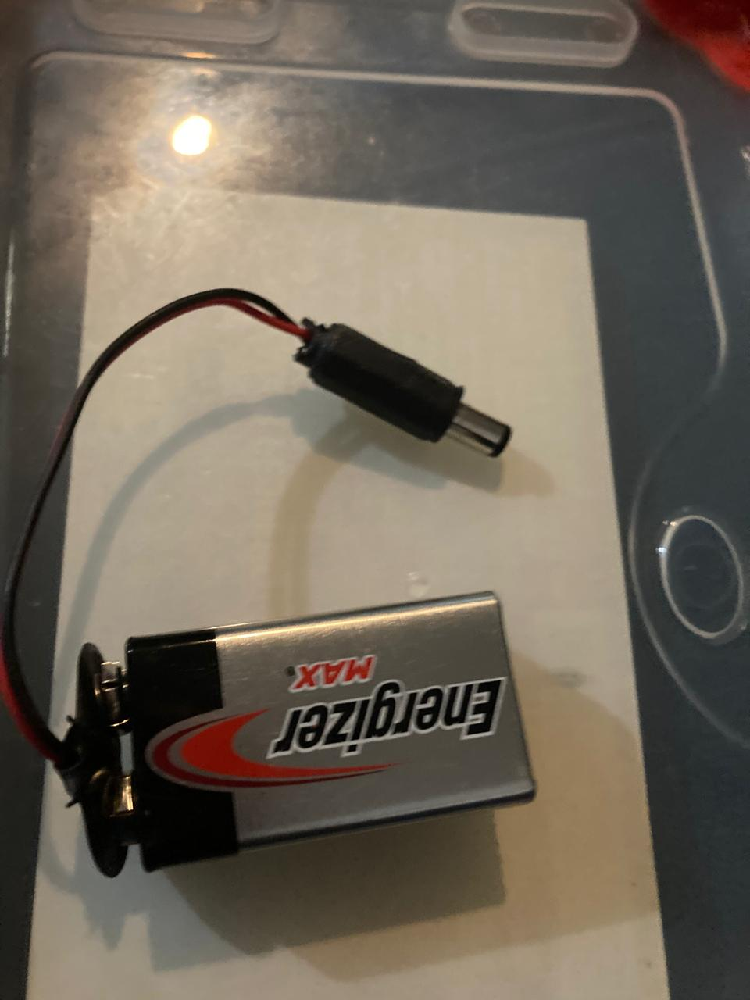
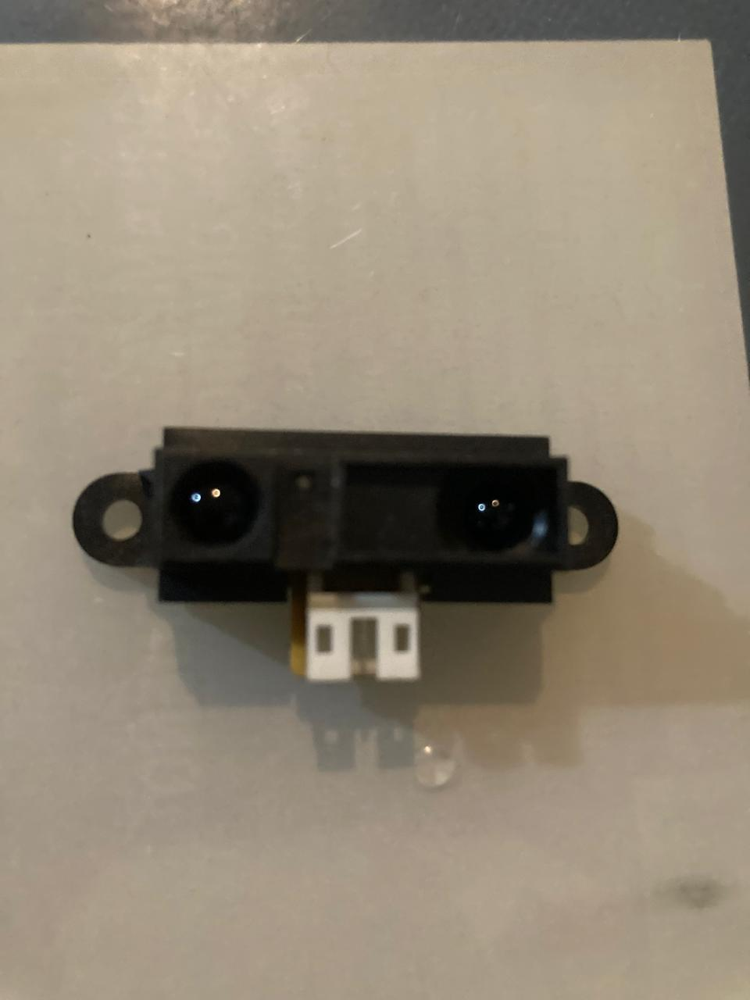

# HC-SR04 ultrasonic distance sensor

That is an **HC-SR04 ultrasonic distance sensor**.

It measures distance using ultrasonic pulses:

- **VCC**: power, usually 5 V
- **Trig**: starts a measurement
- **Echo**: returns the timing signal
- **GND**: ground

The two round components are the ultrasonic transmitter and receiver. The rear board contains the control circuitry.

# DHT11 temperature and humidity sensor module

Updated todo list

That is a **DHT11 temperature and humidity sensor module**.

It measures:

- **Temperature:** approximately 0–50 °C
- **Relative humidity:** approximately 20–80%

The usual pins are:

- **S**: signal/data
- **+**: 5 V or 3.3 V power
- **−**: ground

The blue perforated component is the DHT11 sensor.

# ESP-01 Wi‑Fi module

That is an **ESP-01 Wi‑Fi module**, usually based on the **ESP8266** chip.

It provides Wi‑Fi connectivity for Arduino projects. The exposed pins typically include:

- `VCC`: 3.3 V power
- `GND`: ground
- `TX/RX`: serial communication
- `GPIO0/GPIO2`: programmable input/output
- `EN/CH_PD`: enable pin

Important: use **3.3 V logic and power**; direct 5 V can damage it.

# L298N dual H-bridge motor driver module

That is an **L298N dual H-bridge motor driver module**.

It lets an Arduino control **two DC motors** or **one stepper motor**, including direction and speed.

Typical connections:

- `+12V`: motor power input, usually 7–35 V
- `GND`: common ground
- `+5V`: logic supply or regulator output
- `OUT1/OUT2`: motor A
- `OUT3/OUT4`: motor B
- `ENA/ENB`: enable and speed control via PWM
- `IN1–IN4`: motor direction control

The large black component with the heatsink is the L298N driver IC. Expect significant heat and voltage loss; it is an older, relatively inefficient driver.

# 9 V battery.

Yes, that is a 9 V battery. It powers small electronics and hobby circuits, but it is not ideal for driving motors because it provides limited current.

# proximity sensor module

Updated todo list

That is an **infrared (IR) obstacle-avoidance or proximity sensor module**, likely the **Sharp GP2Y0A21-style IR distance sensor** or a similar replacement.

- The two dark windows are an infrared emitter and receiver.
- It detects nearby objects by emitting infrared light and measuring the reflection.
- The white connector is typically a 3-pin connection: **VCC, GND, and signal**.

Check the label or datasheet before wiring it, because the exact pin order and voltage vary by model.

