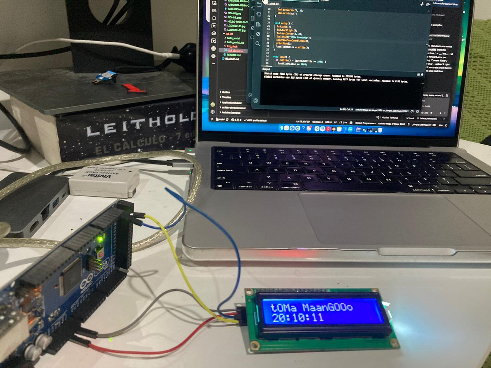

## LCD Clock

Displays "Current Time" and an `HH:MM:SS` clock on a 16x2 I2C LCD, seeded from the sketch's compile time.

### Wiring (Arduino Mega 2560 ↔ LCD1602 I2C backpack)

| LCD I2C backpack pin | Arduino Mega 2560 pin |
|-----------------------|------------------------|
| GND                    | GND                    |
| VCC                    | 5V                     |
| SDA                    | 20 (SDA)               |
| SCL                    | 21 (SCL)               |

> The Mega 2560 has dedicated I2C pins (20/21) — unlike the Uno, it does **not** use A4/A5 for I2C.

### Sketch
See [lcd_clock.ino](lcd_clock.ino).
